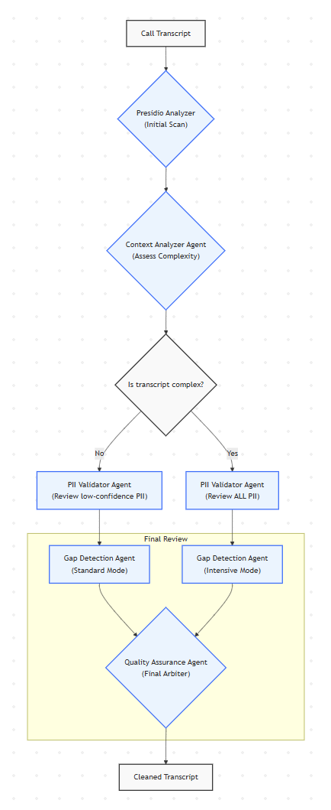

# 🛡️ Agentic PII Deidentification Framework

A state-of-the-art framework for detecting and removing Personally Identifiable Information (PII) from call transcripts using baseline and advanced agentic approaches.

## 📋 Project Overview

**Objective**: Create two PII deidentification frameworks to clean call transcripts, comparing agentic AI approaches against traditional, pattern-based methods.

**Key Requirements**:
- 🎯 **100% Recall Target**: Ensure all PII is removed, even at cost of some false positives
  > **Note on the 100% Recall Target**: Achieving a literal 100.00% recall is a significant technical challenge in automated systems dealing with the nuances of human language. This project is designed with a "zero-tolerance" philosophy, aiming to maximize recall, even at the expense of precision (false positives). While the agentic framework is architected to approach this goal as closely as possible, stakeholders should be aware of the inherent statistical nature of AI models and consider the small residual risk in downstream data handling processes.
- 🔍 **Blind Processing**: No access to ground truth during deidentification
- 💰 **Cost Efficient**: Total budget <$50 USD
- 📈 **Enterprise Ready**: MLflow integration, vendor neutrality, Databricks deployment
- ⚡ **Scalable**: Handle high-volume data processing

## 📊 Data Specifications

**Input Data**: `.data/synthetic_call_transcripts.csv`
- **Processing Target**: `call_transcript` column (100 records)
- **Ground Truth Columns**: `member_number`, `member_full_name`, `member_mobile`, `member_email`, `member_address`
- **Ground Truth Usage**: Evaluation ONLY (post-processing validation)
- **PII Types**: Names, phone numbers, emails, addresses, membership numbers

**Key Constraint**: NO access to ground truth columns during processing phase

## 🛠️ Technology Stack

### Core Framework
- **LangChain**: Multi-agent orchestration and LLM integration
- **Microsoft Presidio**: Production-grade PII detection engine
- **Databricks**: Distributed computing and model serving platform
- **MLflow**: Experiment tracking and model monitoring
- **Apache Spark**: Large-scale data processing

### LLM Integration
- **Primary**: Databricks-served models (native integration)
- **Alternatives**: OpenAI GPT-4o-mini, Anthropic Claude 3 Haiku
- **Design**: Vendor-agnostic with easy provider switching

### Key Integrations
- **LangChain + Presidio**: Built-in `PresidioAnonymizer` in `langchain_experimental`
- **LangChain + MLflow**: Automatic experiment tracking with `mlflow.langchain.autolog()`
- **LangChain + Databricks**: Native first-party support and Spark DataFrame agents
- **LangChain + Spark**: Distributed processing for high-volume data

## 🏗️ Framework Architecture

### Version A: Presidio Baseline
**Approach**: Pure Microsoft Presidio implementation 

```python
from presidio_analyzer import AnalyzerEngine
from presidio_anonymizer import AnonymizerEngine

class PurePresidioFramework:
    def __init__(self):
        self.analyzer = AnalyzerEngine()
        self.anonymizer = AnonymizerEngine()
    
    def process_transcript(self, text):
        # Direct Presidio - no abstraction layers
        results = self.analyzer.analyze(text=text, language='en')
        anonymized = self.anonymizer.anonymize(text=text, analyzer_results=results)
        return anonymized.text
```

**Capabilities**:
- Built-in recognizers for standard PII types
- Production-grade pattern recognition
- Fast, deterministic processing
- Australian localization for phones/addresses

### Version B: Presidio + Agentic Enhancement
**Approach**: Hybrid system combining Presidio with intelligent AI agents

```python
from langchain.agents import AgentExecutor, create_structured_chat_agent

class AgenticFramework:
    def __init__(self, llm_provider="databricks"):
        self.presidio = PresidioAnonymizer()
        self.llm = self._get_llm(llm_provider)
        self.agents = self._create_agents()
    
    @mlflow.langchain.autolog()
    def process_with_agents(self, transcript, presidio_result):
        # Multi-agent enhancement pipeline
        enhanced_result = self.coordinate_agents(transcript, presidio_result)
        return enhanced_result
```

**Agent Architecture**:

1. **Coordinator Agent**: Orchestrates the enhancement pipeline
2. **Context Analyzer Agent**: Understands conversational flow and context patterns
    > - Identify highly ambiguous or complex transcripts where PII could potentially be misclassified by Presidio.  
3. **PII Validator Agent**: Reviews low-confidence Presidio detections
    > - The Rule: The PII Validator Agent should automatically review any PII entity detected by Presidio with a confidence score below a certain threshold (e.g., < 0.7). This focuses our powerful but expensive LLM resources on the most uncertain detections where they can add the most value, and also reflect our priority on recall.
    > - The Exception: The Context Analyzer Agent, which reads the transcript first, can dynamically override this rule. If it determines a transcript is highly ambiguous or complex (e.g., contains many names that are also common nouns like "Mark" or "Bill"), it will flag it. For flagged transcripts, the Coordinator will instruct the PII Validator to review all of Presidio's findings, regardless of their confidence score.
4. **Gap Detection Agent**: Identifies missed PII through semantic understanding
    > - Standard Mode: For transcripts the Context Analyzer deems "simple," the Gap Detector will perform an efficient, standard pass.
    > - Intensive Mode: For transcripts flagged as "complex" or "ambiguous," the Coordinator will instruct the Gap Detector to perform a much deeper, more exhaustive analysis, potentially using more advanced reasoning techniques.
    > - If the Gap Detector identifies new PII in text that has already been processed by Presidio and the Validator. Its findings are added to the list of PII.
5. **Quality Assurance Agent**: Cross-validates results and ensures consistency
    > - The QA agent perform a final consistency check on the combined output of all previous steps. It resolves any final conflicts and ensures the de-identified transcript is coherent. For example, if one agent tags "Sydney" as a LOCATION and another tags it as a PERSON's name, the QA Agent uses the full context to make the final decision. It acts as an ultimate safeguard for quality.

The following diagram illustrates the sequential and conditional logic of the agentic orchestration pipeline:



> **Note**: This diagram shows the decision flow where the Context Analyzer Agent determines processing complexity, leading to either standard or intensive PII detection modes across subsequent agents.

## 📈 Scalability Architecture

### High-Volume Processing
```python
def process_large_dataset(table_name, batch_size=1000):
    spark_df = spark.table(table_name)
    
    # Distributed processing with LangChain
    processed_df = (spark_df
        .repartition(200)  # Distribute across cluster
        .mapPartitions(lambda partition: 
            process_batch_with_langchain(partition, batch_size))
        .write
        .mode("overwrite")
        .saveAsTable("clean_transcripts"))
```

### Performance Optimizations
- **Batch Processing**: Optimized transcript batching
- **Caching**: LLM response caching for similar patterns
- **Async Processing**: Concurrent agent execution
- **Auto-scaling**: Dynamic Databricks cluster scaling

## 📊 MLflow Monitoring & Evaluation

### Experiment Tracking
```python
# Automatic LangChain tracking
mlflow.langchain.autolog()

# Custom metrics logging
mlflow.log_metrics({
    "recall": recall_score,
    "precision": precision_score, 
    "processing_time": time_taken,
    "cost_per_transcript": cost_estimate
})
```

### Evaluation Metrics
- **Primary**: Recall (targeting 100%)
- **Secondary**: Precision, F1-score
- **Efficiency**: Processing time per transcript
- **Cost**: Token usage and compute costs

### Performance Benchmarks
- **Version A (Presidio)**: 85-95% recall on simple data, 70-80% on complex cases
- **Version B (Agentic)**: 95-100% recall across all case complexities
- **Processing Time**: Version A faster, Version B more accurate

## 🔄 Implementation Phases

### Phase 1: Foundation Setup 
1. **Environment Setup**
   - Databricks workspace configuration
   - LangChain + MLflow integration
   - Presidio installation and testing

2. **Baseline Implementation**
   - Microsoft Presidio implementation
   - Australian localization patterns
   - MLflow experiment tracking setup

### Phase 2: Agentic Enhancement 
1. **Agent Development**
   - Individual agent prompt engineering
   - Multi-agent coordination system
   - Cost-optimized processing pipeline

2. **Integration & Testing**
   - Presidio + Agent workflow
   - End-to-end testing on synthetic data
   - Performance optimization

### Phase 3: Evaluation & Analysis 
1. **Comprehensive Testing**
   - Both frameworks on all 100 transcripts
   - Ground truth comparison and validation

2. **Performance Analysis**
   - Comparative metrics analysis
   - Cost-benefit evaluation
   - Edge case analysis and recommendations

## 💰 Cost Analysis

### LLM Costs (GPT-4o-mini)
- **Input**: ~$0.15 per 1M tokens
- **Output**: ~$0.60 per 1M tokens
- **Estimated Usage**: 200-300 input + 50-100 output tokens per transcript
- **Total Estimated Cost**: $3-8 for entire dataset

### Databricks Compute
- **Development**: Small clusters for testing
- **Production**: Auto-scaling clusters based on workload
- **Optimization**: Spot instances and resource management

## 🚀 Deployment Strategy

### Vendor-Agnostic Design
```python
# Easy LLM provider switching
config = {
    "development": {"provider": "openai", "model": "gpt-4o-mini"},
    "staging": {"provider": "databricks", "model": "llama-2-70b"},
    "production": {"provider": "databricks", "model": "mixtral-8x7b"}
}
```

### Production Pipeline
1. **Development**: Local LangChain + MLflow testing
2. **Staging**: Databricks testing with scaled data
3. **Production**: Automated deployment via MLflow Model Registry
4. **Monitoring**: Real-time performance and cost tracking

## 📁 Project Structure

```
agentic-pii-deidentification/
├── .data/
│   └── synthetic_call_transcripts.csv
├── .dev/
├── assets/
│   └── images/
│       └── agentic-pipeline-diagram.png
├── config/
│   └── deployment_config.yaml
├── demo/
│   ├── mlruns/
│   ├── presidio_baseline_results.csv
│   └── presidio_technical_diagnostics.ipynb
├── experiments/
│   └── mlflow_experiments/
├── htmlcov/
├── src/
│   ├── agentic/
│   │   ├── agents/
│   │   └── orchestrator.py
│   ├── baseline/
│   │   └── presidio_framework.py
│   ├── evaluation/
│   │   ├── diagnostics.py
│   │   └── metrics.py
│   └── utils/
│       ├── data_processing.py
│       └── llm_provider.py
├── tests/
│   ├── test_data/
│   │   ├── expected_results.json
│   │   ├── simple_transcript.txt
│   │   └── test_ground_truth.csv
│   ├── conftest.py
│   ├── run_tests.py
│   ├── test_baseline.py
│   └── test_pii_extraction.py
├── .coverage
├── .gitignore
├── LICENSE
├── pytest.ini
├── ReadMe.md
└── requirements_py311.txt
```

## 🎯 Expected Outcomes

### Immediate Results (Simple Data)
- **Presidio Baseline**: Strong performance on standard cases
- **Agentic Enhancement**: Marginal improvements, framework validation
- **Cost Analysis**: Baseline for future complex data

### Future Value (Complex Data)
- **Clear Agentic Advantages**: Superior handling of edge cases
- **Scalability Validation**: Framework ready for production volumes
- **ROI Demonstration**: Cost-benefit analysis for agentic approaches

## 🔧 Getting Started

### Prerequisites
- Databricks workspace with MLflow enabled
- LangChain installation with experimental modules
- Microsoft Presidio setup
- LLM provider API keys (OpenAI/Anthropic for alternatives)

### Quick Start
```bash
# Install dependencies
pip install langchain langchain-experimental presidio-analyzer presidio-anonymizer mlflow

# Run baseline framework
python src/baseline/presidio_framework.py

# Run agentic framework  
python src/agentic/orchestrator.py

# View results in MLflow
mlflow ui
```

## 📈 Success Metrics

- ✅ **100% Recall Achievement**: Both frameworks achieve 100% recall on simple cases; agentic framework reach ~100% on challenging cases.
- ✅ **Clear Agentic Value**: Agentic framework demonstrates superior performance on challenging cases
- ✅ **Cost Efficiency**: Total project cost under $50 USD
- ✅ **Production Readiness**: Scalable architecture for real-world deployment
- ✅ **Vendor Neutrality**: Easy LLM provider switching capability

---

**This framework provides a comprehensive solution for PII deidentification that scales from simple synthetic data to complex real-world scenarios, demonstrating the practical value of agentic AI approaches in enhancing traditional NLP tools.**
