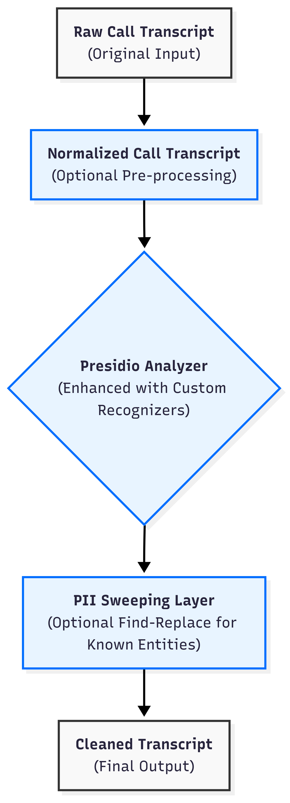

# PII Deidentification Framework: Multi-Layer Security Approach

## Executive Summary

In this project, we implement a robust, multi-layer framework for identifying and redacting Personally Identifiable Information (PII) in text data. This document outlines our systematic approach to PII detection and removal, designed to meet the highest standards of data privacy and security compliance.

## Framework Architecture

Our PII deidentification pipeline employs a sophisticated three-layer approach that maximizes detection accuracy while minimizing false negatives:

### 1. Normalization Layer

The Normalization Layer prepares raw text for optimal PII detection by standardizing format variations.

**Key Functions:**
- **Number Normalization**: Converts spoken numbers into digit form
  - Example: "one two three" → "123"
- **Spell-out Letters**: Covert to meaningful words
  - Example: "j a m e s" → "james"
- **Email Address Normalization**: Standardizes email formatting ready for detection
  - Example: "john smith at company dot com" → "john.smith@company.com"

### 2. Presidio Detection Layer

The Presidio Detection Layer leverages Microsoft's Presidio framework, a state-of-the-art PII detection engine.

-**Built-in recognizers for standard PII types**: Identifies over 20 types of PII entities including:
  - Names, addresses, phone numbers, email addresses
    - Example: "John Smith" --> "`<PERSON>`"
  - Financial information (credit card numbers, bank accolunts)
    - Example: "4111-1111-1111-1111" --> "`<DRIVER_LICENSE>`"
-**Customizable recognizer**" Add custom recognizers for our use case:
  - Autralian localization for phones/addresses
    - Example: "02 9876 5432" --> "`<AU_PHONE_NUMBER>`"
  - Generic_NUMBER recognizer to mask all other numbers
    - Example: "member number 11111111" --> "member number `<GENERIC_NUMBER>`"
**Key Functions:**
- **Context-Aware Analysis**: Considers surrounding text to improve detection accuracy
- **Fast, deterministic processing**: Assigns confidence levels to each detected entity
- **Low operational cost** without third-party API fees
- **Minimized security risk** via self-contained processing

### 3. Sweeping Layer

The Sweeping Layer plays the role of a safety net at last to apply targeted pattern-based replacements to further clean the text with specific types of information that might contain PII.

**Key Functions:**
- **Month Name Replacement**: Replaces all month names with a placeholder
- **Ordinal Number Handling**: Replaces ordinal numbers (1st, 2nd, third, fourth) with generic placeholders
  - Example: "My date of birth is 15th of January, 1981" → "My date of birth is `<GENERIC_NUMBER>` of `<MONTH>`, `<GENERIC_NUMBER>`"
- **Custom Entity Dictionary**: Supports customized replacement lists for all known PII entities
  - An additional cleaning layer to ensure we replace all known PII in our customer data with generic placeholders 
  - Example: "Contact Lucy Smith at lucy.smith@gmail.com" → "Contact `<PERSON>`  at  `<EMAIL>`"

## Security and Compliance Benefits

Our multi-layer approach offers several key advantages for meeting security and compliance requirements:

1. **Defense in Depth**: Multiple processing layers create redundancy, ensuring PII that might be missed by one layer is caught by another
2. **Comprehensive Coverage**: Handles both standard PII entities and customized identifiers
3. **Format Resilience**: Effectively processes unstructured data regardless of how information is expressed (digits, spelled-out letters)
4. **Auditable Process**: Each layer's operation is tested, tracked, timed, and logged for complete transparency
5. **Configurable Security**: Framework can be adjusted based on specific compliance needs or risk tolerance

## Implementation Status

- **1st Iteration**: Normalization and presidio layer has been implemented and rigorously tested. 
- **2nd Iteration**: We are now working on adding the sweeping layer and will run another round of testing with the cleaned text. 

## Conclusion

Our multi-layer PII deidentification framework represents our commitment to protecting sensitive data through a systematic, thorough approach. By combining text normalization, pattern sweeping, and advanced entity recognition, we seek to achieve comprehensive PII detection and redaction that meets the highest standards of security compliance.
